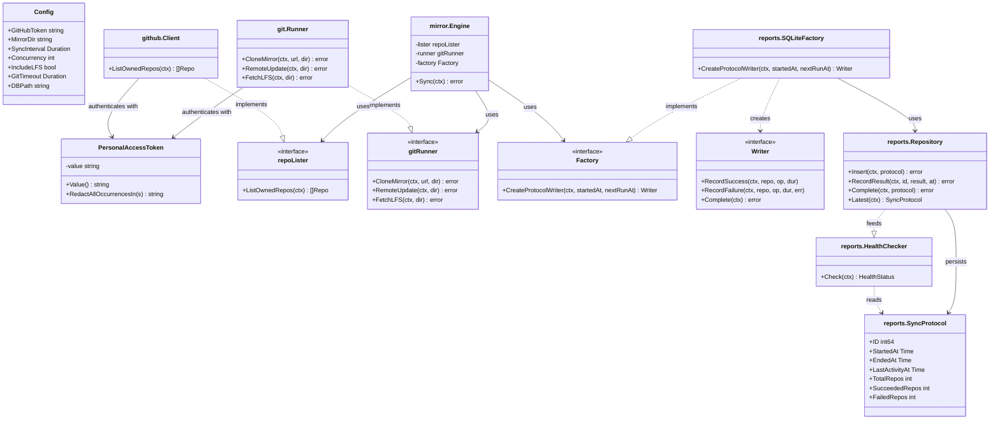
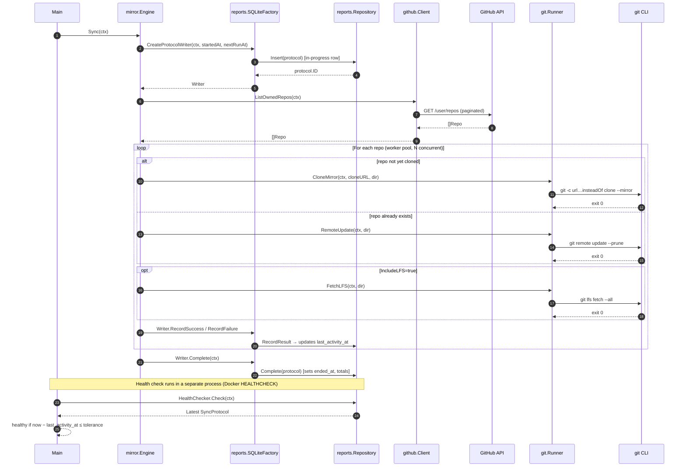

# github-mirror

A lightweight Go daemon that mirrors all GitHub repositories owned by an authenticated
user into bare git clones on a host-mounted directory. Runs as a Docker container;
re-syncs periodically to keep mirrors up-to-date.

## How it works

1. On startup (and on each `SYNC_INTERVAL` tick) the daemon calls the GitHub API to list
   all repositories owned by the authenticated user — public and private.
2. Each repository is bare-mirror-cloned (`git clone --mirror`) on first encounter, or
   updated (`git remote update --prune`) on subsequent runs.
3. Optionally, Git LFS objects are fetched for each repo (`git lfs fetch --all`).
4. A configurable worker pool runs syncs in parallel.
5. Per-repo errors are logged and do not affect the rest of the cycle.

Mirror data is stored on the host via a bind mount so it persists across container
restarts and is independent of the container lifecycle.

## Quick start

```bash
# 1. Clone this repository
git clone https://github.com/Yeti47/github-mirror
cd github-mirror

# 2. Create a mirror directory on the host
mkdir mirror

# 3. Set your PAT (see "PAT scopes" below)
export GITHUB_TOKEN=github_pat_...

# 4. Build and run
docker compose up --build
```

Bare mirror clones will appear under `./mirror/<owner>/<repo>.git/`.

## PAT scopes

A **fine-grained personal access token** with the following permissions is recommended:

| Permission | Level |
|---|---|
| Repository access | All repositories |
| Contents | Read-only |
| Metadata | Read-only |

A classic PAT with the `repo` scope also works but grants broader access.

## Environment variables

| Variable | Default | Description |
|---|---|---|
| `GITHUB_TOKEN` | *(required)* | Read-only personal access token |
| `MIRROR_DIR` | `/data` | Root directory for bare mirror clones (inside container) |
| `SYNC_INTERVAL` | `1h` | How often a full sync cycle runs (e.g. `30m`, `6h`, `24h`) |
| `CONCURRENCY` | `4` | Number of repositories synced in parallel |
| `INCLUDE_LFS` | `true` | Fetch Git LFS objects (`true` / `false`) |
| `GIT_TIMEOUT` | `30m` | Maximum duration for a single git operation |
| `DB_PATH` | `/var/lib/github-mirror/state.db` | SQLite database holding sync-protocol history (read by the healthcheck) |
| `LOG_LEVEL` | `info` | Minimum log level (`debug`, `info`, `warn`, `error`) |

## Health check

The container exposes a Docker `HEALTHCHECK` that re-invokes the binary with
`--health` in a separate process. The health probe reads the most recent sync
protocol from the SQLite database at `DB_PATH` and reports the container as:

- **healthy** if the most recent cycle is in progress and had activity within
  `SYNC_INTERVAL + GIT_TIMEOUT`,
- **healthy** if the most recent cycle completed within
  `SYNC_INTERVAL + GIT_TIMEOUT`,
- **unhealthy** if no cycle has started yet (covered by the `start_period`
  grace window in `docker-compose.yml`),
- **unhealthy** if a cycle has produced no activity for longer than the
  tolerance — indicating a stuck or hung cycle, or
- **unhealthy** if the most recent completed cycle ended longer ago than the
  tolerance — indicating the sync loop has stopped ticking.

The health check is driven by a `last_activity_at` timestamp that is updated
in the database after *every* per-repository result. This means a stuck cycle
is detected without waiting for it to complete: if repositories stop being
processed, the timestamp goes stale and the health probe fires. When a cycle
finishes, `last_activity_at` is set to the completion time, so the same rule
covers the idle window between cycles.

The protocol DB lives in a managed Docker volume (`state`) — *not* a host bind
mount — so its WAL/lock files don't leak onto the host filesystem. Only the
last 100 sync protocols are retained.

## Architecture

### Component overview



### Sync cycle sequence



## Directory layout

```
mirror/
└── <owner>/
    └── <repo>.git/      # bare mirror clone
        ├── HEAD
        ├── config
        ├── objects/
        ├── refs/
        └── lfs/         # Git LFS objects (when INCLUDE_LFS=true)
```

## Restoring a repository

Because mirrors are bare clones, any standard git client can restore a working tree:

```bash
git clone ./mirror/MyGitHubUser/some-repo.git /tmp/restore
```

Or use a local path directly:

```bash
git clone file://$(pwd)/mirror/MyGitHubUser/some-repo.git /tmp/restore
```

## Deleted repositories

If a repository is deleted or renamed on GitHub, its local bare clone is left untouched.
This is intentional for backup purposes — you retain the data even if the upstream is gone.

## Security notes

- The PAT is injected into git operations via a `url.insteadOf` rewrite per-invocation.
  It is **never** written to the on-disk git config inside a bare clone on the bind mount.
- The container runs as a non-root user (uid 1000). The bind-mounted `./mirror` directory
  should be writable by that user on the host.
- The root filesystem is read-only (`read_only: true` in compose). Only `/data` (the bind
  mount) and `/tmp` (a tmpfs) are writable.

## Development

```bash
go build ./...
go vet ./...
go test ./...
```

## Deployment

The repository includes a GitHub Actions workflow (`.github/workflows/release.yml`) that
automatically builds and pushes a multi-architecture container image to
[GHCR](https://docs.github.com/en/packages/working-with-a-github-packages-registry/working-with-the-container-registry)
on every push of a version tag.

### Releasing

To release a new version:

```bash
git tag v1.2.3
git push --tags
```

The workflow will:
1. Build the image for `linux/amd64` and `linux/arm64`
2. Push to `ghcr.io/Yeti47/github-mirror` with tags:
   - `1.2.3` (exact version)
   - `1.2` (minor version)
   - `1` (major version)
   - `latest` (most recent release)
3. Cache build layers using GitHub Actions' cache backend for faster rebuilds

The image is available at [`ghcr.io/Yeti47/github-mirror`](https://github.com/Yeti47/github-mirror/pkgs/container/github-mirror).

## License

This project is licensed under the [MIT License](LICENSE).
